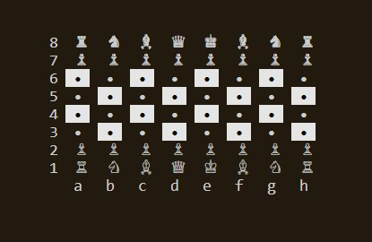
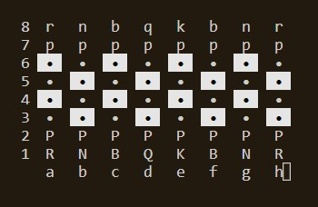

**********************
*Author: Michael Bopp*
**********************
*Last Edited: 8/19/23*
**********************

# Command line chess program utilizing the ncurses library.

The included Perl script can make a seperate Fedora Linux Dockerfile if preferred over Ubuntu.

# Generating a Dockerfile & running a Docker container.

Perl script example:
---

```bash
FedoraBopp@OS Sat Aug 19 CLK:16:42:34 27 /mnt/c/users/Bopp/desktop/docker2 $
./modock.pl
Do you want to create a Fedora (F) or Ubuntu (U) Dockerfile? u
Ubuntu Dockerfile created.
```

Building & running Docker from a Dockerfile:
---

```bash
# Can compile without the no cache flag if no dependency conflict exists, or fresh install.
docker build --no-cache -t ubuntu:chess <filepath to Dockerfile directory>

docker run -v "<filepath to mount onto container from OS>:/workspace" -it ubuntu:chess bash
```

# Makefile contents
```bash
# Move to the chess program directory.
cd src

# Build chess program
make

# Alternative
make chess

# Show available make command keywords.
make list 

# Show commands keywords and their logic. 
make listc

# Remove object & binary files.
make clean
```
Unicode Example
--


ASCII Example
--


---
# Things to do.
Shor-term Roadmap:
---
- [x] Toggle Chess Algebraic Notation
- [ ] Chess Time Counter Per Move
- [ ] King Mouse Movement
- [ ] Queen Mouse Movement
- [ ] Rook Mouse Movement
- [ ] Bishop Mouse Movement
- [ ] Knight Mouse Movement
- [ ] Pawn Mouse Movement
- [ ] Capture Rule
- [ ] Pawn Promotion Rule
- [ ] En Passsant Rule
- [ ] Castling Rule
- [ ] Check Rule
- [ ] CheckMate Rule
- [ ] Algebraic Notation Movement
- [ ] CPP Test Framework
- [x] Docker Container
- [ ] Log of Algebraic Notation
- [ ] Build More Menu stuff
- [ ] Portable Game Notation Exportation

Longterm Roadmap:
---
- [ ] LAN play
- [ ] Chess Tutorial
- [ ] Chess Opener Book
- [ ] Chess Game Engine
